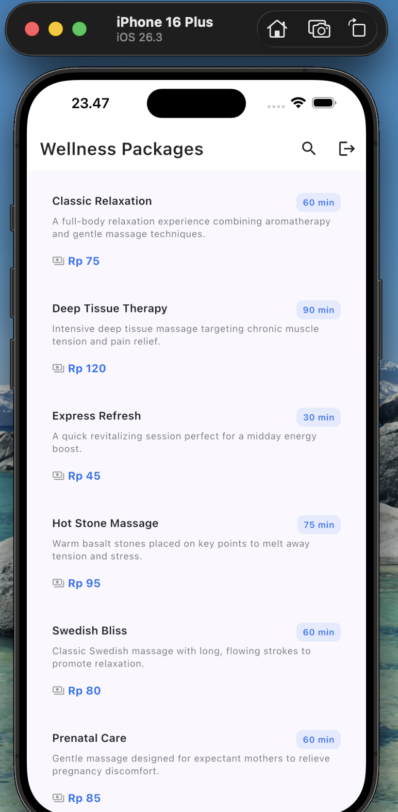

# Flutter Starter Kit

A professional Flutter Starter Kit — scalable, maintainable, and production-ready.

---

## Requirements

| Tool    | Version       |
|---------|---------------|
| Flutter | >= 3.x stable |
| Dart    | >= 3.2.5      |
| Android | minSdkVersion 21 |
| iOS     | Deployment Target 13.0 |

---

## Getting Started

### 1. Clone the repository

```bash
git clone <repo-url>
cd flutter-starter-kit
```

### 2. Install dependencies

```bash
flutter pub get
```

### 3. Setup environment files

Copy the example env file and fill in the values for each flavor:

```bash
cp .env.example .env.dev
cp .env.example .env.staging
cp .env.example .env.prod
```

### 4. Run the app

```bash
# Development
flutter run --flavor dev --dart-define-from-file=.env.dev

# Staging
flutter run --flavor staging --dart-define-from-file=.env.staging

# Production
flutter run --flavor production --dart-define-from-file=.env.prod
```

Or use the Makefile shortcuts:

```bash
make run-dev
make run-staging
make run-prod
```

---

## Project Structure

```
lib/
├── core/           # Constants, DI, network, router, theme, utils
├── features/       # Feature modules (Clean Architecture)
├── shared/         # Shared widgets & models
├── app.dart        # Root widget
└── main.dart       # Entry point
```

---

## Screenshots

| Login | Packages List | Search |
|-------|--------------|--------|
|  |  |  |

---

## Assessment Notes — TUG Full-Stack Assessment (Part 3: Mobile App)

> This section documents the implementation details for the **Wellness Packages** feature
> built as part of the TUG Full-Stack Developer technical assessment.

---

### Feature Implemented

**Wellness Packages List Screen** — displays wellness packages fetched from the backend API.

| Requirement | Status |
|---|---|
| Fetch packages from `GET /api/mobile/packages` | ✅ |
| Display package name, description, price, duration | ✅ |
| Bearer JWT authentication (via `AuthInterceptor`) | ✅ |
| Pull-to-refresh | ✅ Bonus |
| Search with debounce (400ms) | ✅ Bonus |
| Infinite scroll / pagination | ✅ Bonus |
| Currency formatting (`Rp 150.000`) | ✅ Bonus |
| Shimmer loading skeleton | ✅ Bonus |
| Mock datasource for `dev` flavor | ✅ Bonus |
| Unit + widget tests (25 tests) | ✅ Bonus |

---

### Setup & Run

#### Prerequisites

- Flutter ≥ 3.x stable
- Dart ≥ 3.2.5
- Backend API running at `http://localhost:4000` (see `/backend`)

#### Test Account

| Field    | Value              |
|----------|--------------------|
| Email    | user@example.com   |
| Password | user123            |

#### Steps

```bash
# 1. Install dependencies
flutter pub get

# 2. Create the dev env file from the example (set BASE_URL=http://localhost:4000)
cp .env.example .env.dev

# 3. Run in development (uses mock datasource — no real backend needed)
make run-dev
# or:
flutter run --flavor dev --dart-define-from-file=.env.dev

# 4. Run against real backend (staging flavor)
flutter run --flavor staging --dart-define-from-file=.env.staging

# 5. Run tests
flutter test
# or with coverage:
make test
```

> **Note:** The `dev` flavor uses `WellnessPackageRemoteDataSourceMock` which returns
> 5 fixture packages with an 800ms simulated delay — no real backend needed to see
> the packages screen in action.

---

### Wellness Packages — Feature Structure

```
lib/features/wellness_packages/
├── domain/
│   ├── entities/
│   │   ├── wellness_package.dart        # Pure domain entity
│   │   ├── paginated_packages.dart      # Paginated result + hasNextPage getter
│   │   └── get_packages_params.dart     # Query params (page, limit, search, sort)
│   ├── repositories/
│   │   └── wellness_package_repository.dart   # Abstract interface
│   └── usecases/
│       └── get_wellness_packages_use_case.dart
├── data/
│   ├── models/
│   │   ├── wellness_package_model.dart        # fromJson DTO
│   │   └── paginated_packages_model.dart      # Parses nested API envelope
│   ├── datasources/
│   │   ├── wellness_package_remote_data_source.dart        # Abstract
│   │   ├── wellness_package_remote_data_source_http.dart   # HTTP (staging/prod)
│   │   └── wellness_package_remote_data_source_mock.dart   # Mock (dev)
│   └── repositories/
│       └── wellness_package_repository_impl.dart
└── presentation/
    ├── blocs/
    │   ├── wellness_packages_bloc.dart
    │   ├── wellness_packages_event.dart
    │   └── wellness_packages_state.dart
    ├── pages/
    │   └── wellness_packages_page.dart
    └── widgets/
        ├── wellness_package_card.dart
        ├── wellness_package_loading.dart   # Shimmer skeleton
        ├── wellness_packages_empty.dart
        └── wellness_packages_error.dart

test/features/wellness_packages/
├── domain/get_wellness_packages_use_case_test.dart   # 5 tests
├── data/wellness_package_repository_impl_test.dart   # 6 tests
└── presentation/
    ├── wellness_packages_bloc_test.dart               # 9 tests
    └── wellness_package_card_test.dart                # 5 tests  (widget test)
```

---

### Architectural Decisions

#### Clean Architecture
The feature follows the same **Clean Architecture** layering as the existing `auth` feature:

- **Domain layer** contains pure Dart entities and abstract repository interfaces — zero Flutter/platform dependencies.
- **Data layer** owns DTOs, datasources, and the repository implementation. It converts raw JSON and all exceptions into domain types before they cross the layer boundary.
- **Presentation layer** uses BLoC for state management. Widgets depend only on states and events, never on the data layer directly.

This makes it straightforward to swap the HTTP datasource for a mock (done for the `dev` flavor) or add a caching layer without touching the domain or UI code.

#### BLoC over Riverpod / Provider
The starter kit already uses `flutter_bloc`. Staying consistent avoids mixing paradigms in the same codebase and lets `GoRouter`'s `refreshListenable` mechanism (already wired for `AuthBloc`) work uniformly across features.

#### `fpdart` Either — no throwing across layer boundaries
All errors are converted to typed `Failure` subclasses (`NetworkFailure`, `ServerFailure`, `UnauthorizedFailure`) inside the repository. The BLoC and UI never see raw exceptions, making error paths explicit and testable.

#### Environment-scoped datasources (`@LazySingleton(env: [...])`)
`get_it` + `injectable` resolves the correct datasource based on the current flavor:
- `dev` → `WellnessPackageRemoteDataSourceMock` (5 fixtures, no network)
- `staging` / `production` → `WellnessPackageRemoteDataSourceHttp`

This means the dev build works without a running backend, and there is no `if (kDebugMode)` scattered through business logic.

#### Pagination via `PaginatedPackages.hasNextPage`
Page tracking is derived from the current BLoC state (`current.paginatedData.page + 1`) rather than a separate `_currentPage` field, which eliminates the class of bugs where mutable state drifts out of sync with the emitted states.

---

### Assumptions

1. **API base URL** for the mobile app is `http://localhost:4000` in dev/staging (set via `.env.dev` / `.env.staging`). This matches the backend setup in the repository.
2. **Authentication** — the user must be logged in before reaching the packages screen. The existing `GoRouterRefreshStream` already redirects unauthenticated users to `/login`.
3. **Currency** — price is treated as IDR (Indonesian Rupiah) and formatted with dot separators (`Rp 150.000`). No locale-aware `NumberFormat` dependency was added; the formatting is done with a simple string utility to avoid adding `intl` solely for this feature.
4. **Sorting defaults** — `sortBy: 'createdAt'`, `sortOrder: 'desc'` (newest first), matching the backend's default behavior.
5. **Page size** — 10 items per page (matches backend default `limit`).
6. **Search** — dispatches `WellnessPackagesLoadRequested(search: query)` with a 400ms debounce; clearing the search field reloads the unfiltered list.

---

## Available Scripts (Makefile)

| Command              | Description                        |
|----------------------|------------------------------------|
| `make run-dev`       | Run app in development mode        |
| `make run-staging`   | Run app in staging mode            |
| `make run-prod`      | Run app in production mode         |
| `make build-apk`     | Build release APK (production)     |
| `make build-aab`     | Build release AAB (production)     |
| `make test`          | Run all tests with coverage        |
| `make analyze`       | Run Flutter analyzer               |
| `make format`        | Format all Dart files              |
| `make gen`           | Run build_runner code generation   |

---

## Branching Strategy

```
main        ← production, protected
develop     ← integration
feature/*   ← new features
bugfix/*    ← bug fixes
hotfix/*    ← urgent production fixes
release/*   ← release preparation
```

---

## Tech Stack

- **State Management**: flutter_bloc
- **Navigation**: go_router
- **DI**: get_it + injectable
- **Networking**: Dio + fpdart (Either)
- **Storage**: Hive + flutter_secure_storage + shared_preferences
- **Analytics**: Firebase Analytics + Crashlytics
- **Testing**: mocktail + flutter_test

---

## Contributing

1. Fork the repository
2. Create a feature branch (`git checkout -b feature/your-feature`)
3. Commit your changes (follow [Conventional Commits](https://www.conventionalcommits.org/))
4. Push and open a Pull Request against `develop`

